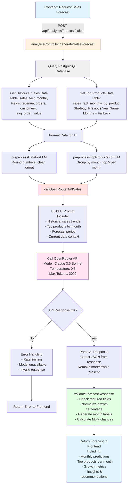
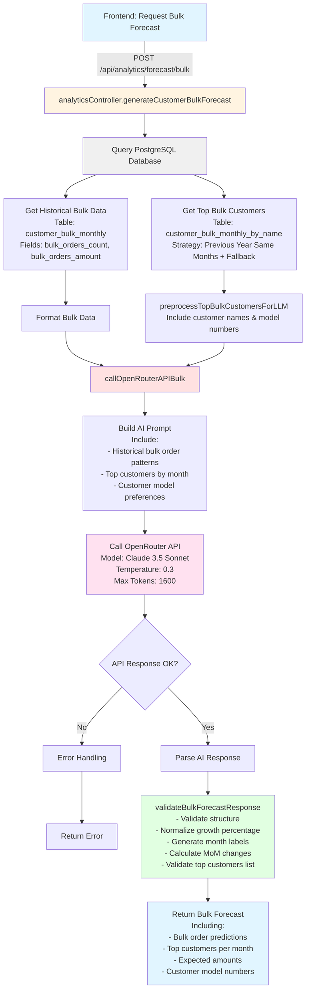
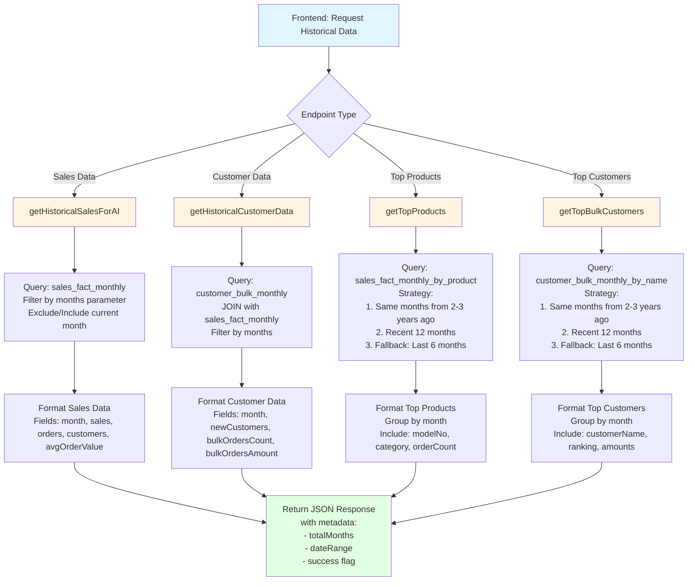
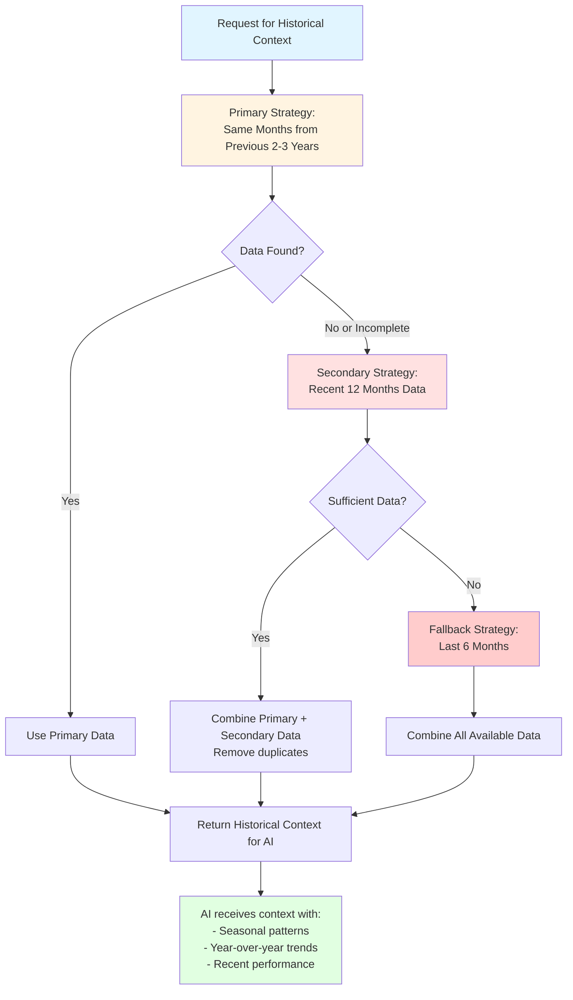
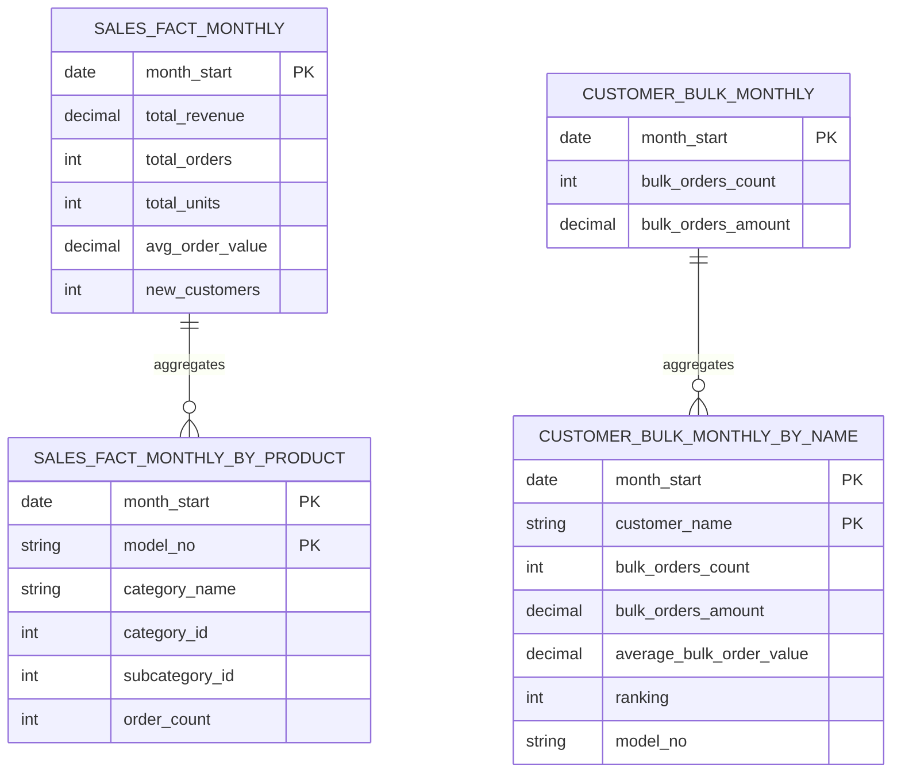
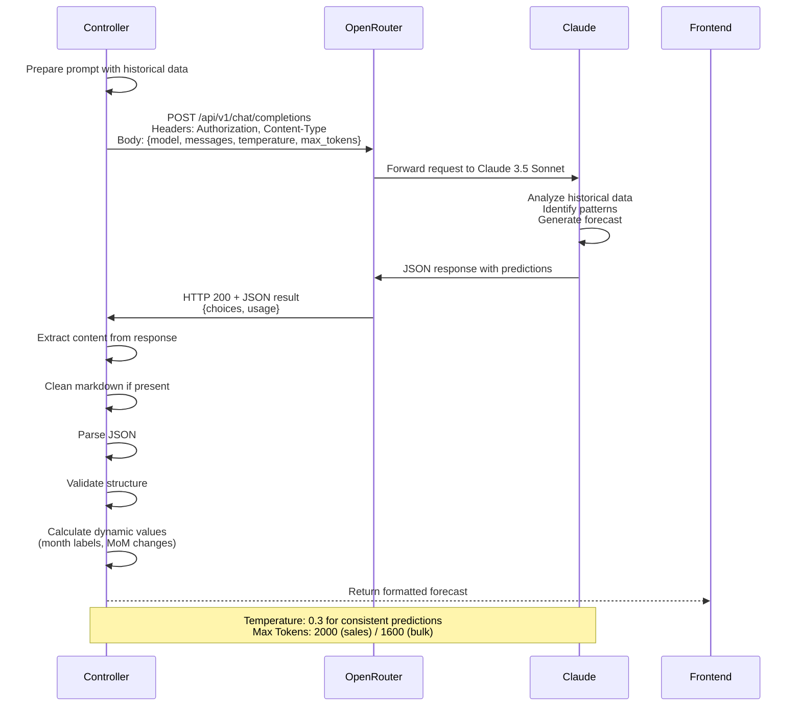

# Analytics System Flow Diagram

## Overview
This document explains how the analytics forecasting system works in `analyticsController.js`.

---

## 1. Sales Forecast Generation Flow



---

## 2. Bulk Customer Forecast Flow



---

## 3. Historical Data Retrieval Flow



---

## 4. Data Strategy: Historical Data Lookup



---

## 5. Database Schema Overview



---

## 6. OpenRouter API Integration



---

## 7. Error Handling Flow

```mermaid
flowchart TD
    A[API Call to OpenRouter] --> B{Response Status}
    
    B -->|404| C[Model Not Available Error]
    B -->|429| D[Rate Limited Error]
    B -->|Other Error| E[Generic API Error]
    B -->|200 OK| F[Parse Response]
    
    F --> G{Valid JSON?}
    
    G -->|No| H[JSON Parse Error]
    G -->|Yes| I{Has Required Fields?}
    
    I -->|No| J[Validation Error]
    I -->|Yes| K[Success]
    
    C --> L[User-Friendly Error Message:<br/>"AI model is not available"]
    D --> M[User-Friendly Error Message:<br/>"Service temporarily busy"<br/>Retryable: true]
    E --> N[User-Friendly Error Message:<br/>"Service temporarily unavailable"]
    H --> O[User-Friendly Error Message:<br/>"Unexpected response format"]
    J --> P[User-Friendly Error Message:<br/>"Invalid forecast structure"]
    
    L --> Q[Return 500 Error Response]
    M --> Q
    N --> Q
    O --> Q
    P --> Q
    
    K --> R[Return 200 Success Response]
    
    style A fill:#e1f5ff
    style K fill:#e1ffe1
    style C fill:#ffcccc
    style D fill:#ffcccc
    style E fill:#ffcccc
    style H fill:#ffcccc
    style J fill:#ffcccc
    style R fill:#ccffcc
```

---

## Key Features

### 1. **Intelligent Data Lookup Strategy**
- **Primary**: Same months from previous 2-3 years (seasonal patterns)
- **Secondary**: Recent 12 months (current trends)
- **Fallback**: Last 6 months (minimum context)

### 2. **AI Model Configuration**
- **Model**: Claude 3.5 Sonnet (via OpenRouter)
- **Temperature**: 0.3 (balanced between creativity and consistency)
- **Max Tokens**: 2000 for sales, 1600 for bulk forecasts

### 3. **Data Preprocessing**
- Round monetary values
- Normalize customer names
- Group products by category
- Calculate historical averages

### 4. **Validation & Normalization**
- Ensure required fields exist
- Normalize growth percentages (0-100 scale)
- Generate dynamic month labels
- Calculate Month-over-Month changes
- Validate top products/customers lists

### 5. **Response Enhancement**
- Add metadata (timestamps, usage stats)
- Include confidence metrics
- Provide actionable insights
- Generate recommendations

---

## Environment Variables Required

```env
OPENROUTER_API_KEY=your_api_key_here
OPENROUTER_REFERER=http://localhost:3000
DATABASE_URL=postgresql://...
```

---

## API Endpoints Summary

| Endpoint | Method | Purpose |
|----------|--------|---------|
| `/api/analytics/historical-sales` | GET | Get historical sales data for AI training |
| `/api/analytics/historical-customers` | GET | Get historical customer data |
| `/api/analytics/top-products` | GET | Get top performing products by month |
| `/api/analytics/top-bulk-customers` | GET | Get top bulk customers by month |
| `/api/analytics/forecast/sales` | POST | Generate AI sales forecast |
| `/api/analytics/forecast/bulk` | POST | Generate AI bulk customer forecast |
| `/api/analytics/dashboard-metrics` | GET | Get dashboard summary metrics |
| `/api/analytics/ytd-growth` | GET | Calculate Year-to-Date growth |

---

## Notes

1. **No JSON File Reading**: The system queries PostgreSQL database directly, not JSON files
2. **Real-time Processing**: All data is fetched and processed in real-time
3. **Caching**: Consider implementing Redis caching for frequently accessed data
4. **Rate Limiting**: OpenRouter API has rate limits - handle gracefully
5. **Database Performance**: Ensure indexes on `month_start` columns for fast queries

